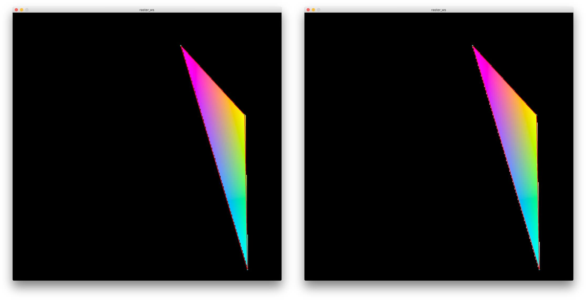

# Taller raster

## Propósito

Comprender algunos aspectos fundamentales del paradigma de rasterización.

## Tareas

Emplee coordenadas baricéntricas para:

1. Rasterizar un triángulo; y,
2. Sombrear su superficie a partir de los colores de sus vértices.

Referencias:

* [The barycentric conspiracy](https://fgiesen.wordpress.com/2013/02/06/the-barycentric-conspirac/)
* [Rasterization stage](https://www.scratchapixel.com/lessons/3d-basic-rendering/rasterization-practical-implementation/rasterization-stage)

Opcionales:

1. Implementar un [algoritmo de anti-aliasing](https://www.scratchapixel.com/lessons/3d-basic-rendering/rasterization-practical-implementation/rasterization-practical-implementation) para sus aristas; y,
2. Sombrear su superficie mediante su [mapa de profundidad](https://en.wikipedia.org/wiki/Depth_map).

Implemente la función ```triangleRaster()``` del sketch adjunto para tal efecto, requiere la librería [frames](https://github.com/VisualComputing/frames/releases).

## Integrantes

Dos, o máximo tres si van a realizar al menos un opcional.

Complete la tabla:

| Integrante | github nick |
|------------|-------------|
| Juan David Saab | @juansaab             |

## Discusión

Describa los resultados obtenidos. En el caso de anti-aliasing describir las técnicas exploradas, citando las referencias.

Se realizó una función de antialiasing siguiendo el concepto de multisampling con cuatro muestras por pixel. Como referencia se tomó la información del artículo [Anti Aliasing en Learn OpenGL](https://learnopengl.com/Advanced-OpenGL/Anti-Aliasing)

La comparación entre un triángulo con y sin antialiasing puede apreciarse en la siguiente imagen. A la izquierda sin antialiasing y a la derecha con antialiasing.




## Entrega

* Plazo: 7/10/18 a las 24h.
